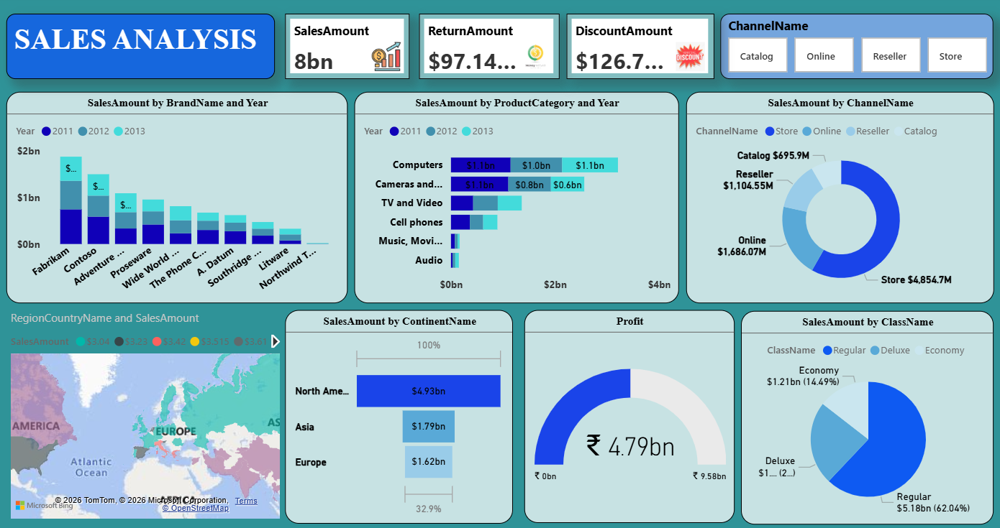
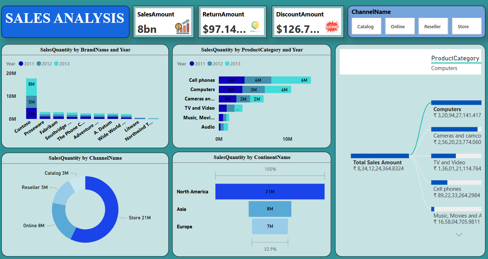

  

<h1 align="center">Hi 👋, I'm Pradnil Birje</h1>
<h3 align="center">Aspiring Data Analyst | Power BI • SQL • Python • Tableau</h3>

  

## 🛠️ Tech Stack

## 📖 About Me

• 👋 Hi, I’m @Pradnil Birje  
• 📊 Passionate about transforming raw data into actionable insights  
• 🛠️ Skilled in Power BI, SQL, Python, Tableau, and Excel  
• 📈 Interested in Business Intelligence, Data Visualization, and Analytics  
• 🚀 Currently building real-world analytics projects and dashboards  
• 🌱 Continuously learning and improving in the tech & analytics field  
• 📫 How to reach me www.linkedin.com/in/pradnilbirje24    
• 😄 Pronouns: He/Him  

## 🚀 Featured Projects

### 🛒 E-Commerce Sales & Customer Analytics
📌 Technologies: SQL, MySQL  
📊 Analyzed customer behavior, sales trends, and business insights using SQL queries and relational database concepts.

---

### 📈 Product Sales Dashboard
📌 Technologies: Power BI, Excel  
📊 Interactive dashboard focused on product performance, sales KPIs, and business intelligence reporting.

---

### 💹 Sales Performance Analysis
📌 Technologies: Python, VS Code, Pandas, Matplotlib, Seaborn, Kaggle Dataset  
📊 Performed exploratory data analysis and visualized sales performance trends to uncover actionable insights.

## 📜 Certifications

• 🎓 Master In Data Science & Analytics With Artificial Intelligence - NSDC  
• 📊 Python for Data Science - IBM  
• 💻 Analyzing and Visualizing Data with Microsoft Power BI - Itvedant  

## ✍️ Featured Blog

### 📊 Data Analysis vs Data Analytics
Understanding the key differences between Data Analysis and Data Analytics, including roles, processes, tools, and business impact.

🔗 [Read the Blog](https://medium.com/data-and-beyond/data-analytics-vs-data-analysis-heres-what-i-have-learned-2e611f8060aa)

## 📈 GitHub Stats

## 📄 Resume

📥 [Download My Resume](./Pradnil_Birje_Data_Analyst_resume.pdf)

## 🌐 Connect With Me

## 👀 Profile Visitors

⭐️ From [PradnilBirje](https://github.com/PradnilBirje)

---

📊 Turning Data into Meaningful Insights

> “Without data, you're just another person with an opinion.”

<!---
PradnilBirje/PradnilBirje is a ✨ special ✨ repository because its `README.md` (this file) appears on your GitHub profile.
You can click the Preview link to take a look at your changes.
--->
